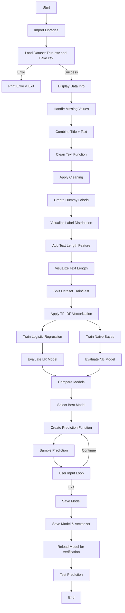

# 📰 Fake News Detection System

## →→→ Introduction

In today’s digital age, information spreads rapidly through social media and online platforms. However, not all information is reliable, and fake news has become a serious issue affecting society, politics, and public opinion.

This project presents a Python-based Fake News Detection System that uses machine learning techniques to classify news as real or fake.

- Processes textual data  
- Cleans and preprocesses content  
- Converts text using TF-IDF  
- Applies classification algorithms  

The goal is to build a simple system that helps users identify misleading or false information.

---

## Real-World Problem

Many problems caused by fake news include:

- Spread of misinformation  
- Public panic or confusion  
- Political manipulation  
- Damage to reputation  
- Misleading decisions  

**Major Issue:**
- Difficulty in verifying authenticity of news  

An automated system can help detect fake news quickly.

---

## Objectives

- Classify news as REAL or FAKE  
- Clean and preprocess text data  
- Apply machine learning models  
- Compare model performance  
- Provide real-time predictions  

---

## Concepts Used (From Coursework)

- Data preprocessing  
- String manipulation  
- Functions (modular design)  
- Conditional statements  
- Machine Learning basics  
- Data visualization  

---

## Tools & Technologies

- Python 3.x  

- Libraries:  
  - pandas  
  - numpy  
  - matplotlib  
  - re  
  - string  
  - scikit-learn  
  - pickle  

- Console-based UI  

---

## Problem Definition

- Manual verification of news is not practical  
- Large volume of online content  
- Need for automated detection  

This system solves the problem using machine learning.

---

## Requirements Analysis

### Functional Requirements

- Load dataset (`True.csv and Fake.csv` )  
- Clean and preprocess text  
- Convert text using TF-IDF  
- Train ML models  
- Predict fake/real news  
- Accept user input  
- Save and load model  

### Non-Functional Requirements

- Easy to use  
- Fast execution  
- Accurate predictions  
- Low memory usage  

---

## Top-Down Design (Modules)

---
load_data()        → Reads dataset  
clean_text()       → Cleans text  
vectorize_text()   → TF-IDF conversion  
train_models()     → Train ML models  
evaluate_models()  → Compare models  
predict_news()     → Predict output  
main()             → Runs system

---

## Step-Wise Algorithm 

- Start
- Load dataset
- Clean text
- Combine title + content
- Apply TF-IDF
- Split dataset
- Train models
- Evaluate models
- Select best model
- Take user input
- Predict result
- Save model
- End
-Save model
-End

---

##  Flowchart 

## 📊 Project Flowchart


## ⚙️ Setup & Installation Guide

Follow these steps to set up and run the **Fake News Detection System** on your local machine.

---

### 📌 1. Prerequisites

Make sure you have the following installed:

- Python 3.x  
- pip (Python package manager)  

Check installation:

```bash
python --version
pip --version

### 📥 2. Clone the Repository

```bash
git clone https://github.com/mohit25bai11342-gif/fake-news-detection-system.git
cd fake-news-detection
```

---

### 🧪 3. Create Virtual Environment (Recommended)

#### ▶️ Windows
```bash
python -m venv venv
venv\Scripts\activate
```

#### ▶️ Mac/Linux
```bash
python3 -m venv venv
source venv/bin/activate
```

---

### 📦 4. Install Dependencies

Install required libraries:

```bash
pip install pandas numpy matplotlib scikit-learn
```

#### OR create a `requirements.txt` file:

```txt
pandas
numpy
matplotlib
scikit-learn
```

### 📂 5. Dataset Setup (CSV File)

This project uses a **CSV dataset**.

- Place your dataset file named **`Fake.csv  and True.csv`** in the project root directory.

#### 📊 Required Columns:
- `title` → News headline  
- `text` → News content
- `subject` 
- `date`  

#### Example format:

```csv
title,text,subject,date

```

---

### ▶️ 6. Run the Project

```bash
python main.py
```

---

### 💬 7. Usage

- The model will train automatically.  
- You can input your own news text for prediction.  

#### Example:

```text
Enter news: Government launches new scheme
Result: REAL ✅
```

Type `exit` to stop the program.


### ⚙️ Configuration

Before running the project, ensure the following configurations:

- The dataset file **`Fake.csv and True.csv`** is placed in the root directory.
- The CSV file must contain the following columns:
  - `title` → News headline  
  - `text` → News content
  - `subject` 
  - `date`     

- You can modify the script if needed:
  - Change dataset path:
    ```python
    data = pd.read_csv(" Fake.csv ")
     data = pd.read_csv("True.csv")
    ```
  - Adjust model parameters:
    - Logistic Regression (`max_iter=1000`)
    - TF-IDF (`max_df=0.7`, `stop_words='english'`)

- Ensure all dependencies are installed (see Installation section).

---

### ▶️ Execution

Run the Python script to start the project:

```bash
python main.py
```

#### 🔄 What happens during execution:

1. Dataset is loaded and cleaned  
2. Text preprocessing is applied  
3. Dummy labels are generated  
4. Data is split into training and testing sets  
5. TF-IDF vectorization is performed  
6. Models are trained:
   - Logistic Regression  
   - Naive Bayes  
7. Models are evaluated and compared  
8. Best model is selected  
9. User can input custom news for prediction  
10. Model and vectorizer are saved (`model.pkl`, `vectorizer.pkl`)  

---

#### 💡 Example Run:

```text
Enter news: Government launches new scheme
Result: REAL ✅
```


### 🧪 Test News Inputs

#### 🔹 General News
```text
Government launches new education policy for students across the country
Breaking: Scientists discover a new planet similar to Earth in distant galaxy
Stock markets hit record high as economy shows strong growth signals
New study reveals benefits of daily exercise for mental health
Heavy rainfall causes flooding in several parts of the city
```

---


##   News 

```text

- U.S. economy shows steady improvement in latest quarterly report
- Government officials discuss immigration policy reforms in Washington
- Federal court rejects appeal on major financial regulation case
- Senate approves budget proposal after long debate
- White House announces new healthcare policy initiative
- U.S. lawmakers pass new bill to improve economic growth
- Treasury department releases updated financial guidelines
- Congress prepares for discussions on national security policies
- New tax reform bill introduced in the Senate
- Officials confirm progress in international trade agreements
```
  
#### ❌ Fake-like / Sensational News (for testing model behavior)
```text
Shocking! Aliens have landed on Earth and taken control of major cities
Miracle cure for all diseases discovered, doctors hate this secret
Breaking: Drinking only water for 7 days can make you immortal
Secret government project reveals humans can time travel
Celebrity confirms the world will end next week
```

---

#### 🧠 Mixed / Realistic News (Best for Testing)
```text
India announces new digital policy to improve online security
Researchers develop AI system to detect fake news more accurately
Government increases budget allocation for healthcare sector
Tech companies invest heavily in artificial intelligence development
```

Type `exit` to stop execution.


---

### 🛠️ 9. Troubleshooting

#### ❌ Error: `news.csv not found`

✔️ Make sure the CSV file is in the same directory as your script  

---

#### ❌ Missing modules

✔️ Install dependencies again:

```bash
pip install -r requirements.txt
```
### 🚀 Future Enhancements

- Use a **real labeled dataset** instead of dummy labels for better accuracy  
- Implement advanced models like:
  - LSTM (Deep Learning)
  - BERT (Transformer-based NLP model)  
- Improve text preprocessing using:
  - Stemming / Lemmatization  
  - Stopword customization  
- Add a **web interface** using Flask or Streamlit  
- Deploy the model on cloud platforms (AWS, Azure, or Heroku)  
- Add real-time news scraping from APIs for live detection  
- Improve visualization with interactive dashboards  

---

### 🌍 Real-World Applications

- **Fake News Detection Platforms** → Identify misleading or false news articles  
- **Social Media Monitoring** → Detect misinformation spread on platforms like Twitter, Facebook  
- **News Aggregators** → Filter and rank trustworthy news content  
- **Government & Policy Making** → Help in controlling misinformation campaigns  
- **Educational Tools** → Teach digital literacy and critical thinking  
- **Journalism** → Assist reporters in verifying news authenticity  

---

### 📌 Conclusion

This project demonstrates how **Machine Learning** can be used to detect fake news using text data.  
By applying techniques like **TF-IDF vectorization** and classification algorithms such as **Logistic Regression** and **Naive Bayes**, the system can analyze and classify news content effectively.  

Although the current implementation uses **dummy labels**, it provides a strong foundation for building a real-world fake news detection system. With further improvements and real datasets, this project can be extended into a powerful and practical application.

---
